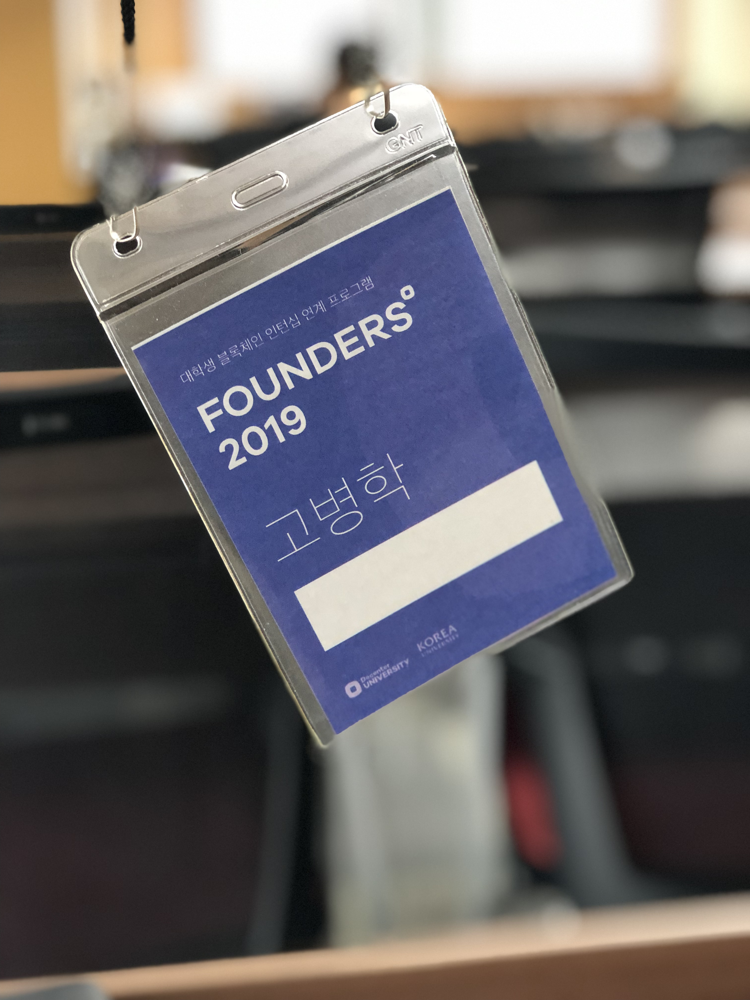

진행기간: 2019.01.14(월) ~ 2019.01.18(금)
장소: 고려대(안암), 위워크(선릉)

## 참가한 계기
원래 2018-2학기에 학교 공부와 블록체인 공부를 병행하려고 했지만 그렇게 되지 않아서 고민하던 때에 학교 오픈톡방에서 블록체인관련 대외활동이 있다는 얘기를 듣고 바로 지원하게 되었다.  
코인으로 돈 잃은 것도 한 몫 했다 ㅋㅋ..(도대체 블록체인이 뭔지 알고싶어서?)  

## 활동 내용  
**1,2일차**  
쭉 블록체인의 기본 개념과 dapp에 대한 강의들을 진행했다.  
이번 프로그램 참가자의 분포가 50%정도만 개발 쪽이었고, 나머진 마케팅, 기획, 경영이라고 들었다.  
그래서 그런지 기술적인 이야기가 많이 배제되어 있어서 많이 아쉬웠다.  
블록체인 기술을 설명할 때 더 깊은 지식을 전달할 수 있는 유능하신 분들이 눈 앞에 있었지만 기술적인 지식을 얻지 못해서 참 아쉬웠다.  
그래서 강의 내용은 대부분 블록체인이 왜 쓰여야하며 현재 블록체인 산업이 얼마나 유망한 분야인지에 대한 것이었다.  

강의를 들으면서 느낀 점은 블록체인 산업이 코인 광풍이 불어서 생긴 부산물이라는 것이었다. 그래서 3,4일차에 서비스를 만들어 낼 때도 엄청 고생했다. 도대체 어떤 컨텐츠에 블록체인을 붙여서 엄청난 시너지를 일으킬까라는 의문이 계속해서 들었기 때문이다. 이 의문에 대해서 멘토님들에게도 여쭤봐도 명쾌한 해답은 나오지 않았다.  

**3,4일차**
1,2일차에서 얻은 블록체인관련 지식을 바탕으로 서비스를 기획했다. 우리팀은 총 8명이었는데 8명이서 아이디어를 내려니까 계속 삐걱거렸다. 이 때 혼자서는 힘들지만 사람이 많은 것은 더 안 좋다는 것을 느꼈다.  
추가로 어떤 아이디어를 내도 "Why Blockchain" 이라는 물음에 답을 하지 못했다.  
그렇게 3,4일차에 dapp에 대해 공부하고 서비스를 기획했다.  
우리 팀은 MotiBetting이라는 dapp을 기획했다. 하지만 이것도 "Why Blockchain"에는 명쾌한 답을 내지 못했다. 

**5일차**
모든 팀이 모여 발표하고 수상까지 했다. 1등팀은 강의평가를 블록체인으로 하는 것이었다. 이 팀이 1등을 했을 때에 모두가 의아했다. 2등은 RecoBlock이라는 음성파일의 신뢰성을 증명해주는 dapp이었다. 사실 이 팀이 1등이 될거라고 생각을 했다. 우리팀은 수상하지 못해서 너무 아쉬웠다...  

## 결론 
난 이번 활동을 통해서 블록체인 산업이 코인광풍의 부산물이라는 것을 느꼈다.  
이 산업이 블루오션인지는 아직 잘 모르겠다.  
